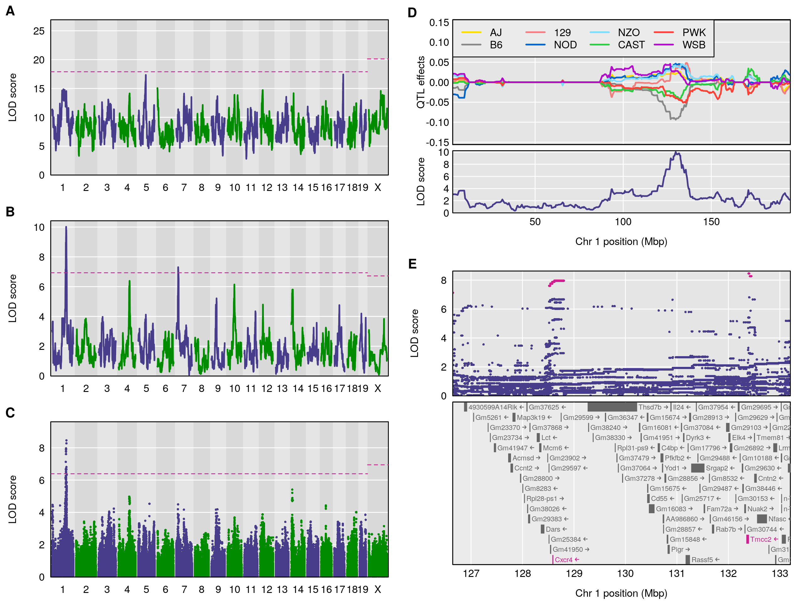

  

      <ul class="nav">
          <li><a href="samplemixups_fig7.html">prev</a></li>
          <li><a href="isletc6_fig4.html">next</a></li>
      </ul>
  

Broman KW, Gatti DM, Simecek P, Furlotte NA, Prins P, Sen &#346;,
Yandell BS, Churchill GA (2019)
R/qtl2: software for mapping quantitative trait loci with
high-dimensional data and multi-parent populations.
[Genetics](https://genetics.org) 211:495-502

**Figure 1**. &mdash; Reconstruction of Fig. 5 from [Gatti et al.
(2014)](https://doi.org/10.1534/g3.114.013748), on the mapping of
constitutive neutrophil counts in 742 Diversity Outbred mice. (A) LOD
scores from a genome scan using the full model (comparing all 36
genotypes for the autosomes and 44 genotypes for the X chromosome);
the dashed horizontal line indicates the 5\% genome-wide significance
threshold, based on a permutation test. (B) LOD scores from a genome
scan with an additive allele model (compare the 8 founder haplotypes).
(C) LOD scores from a SNP association scan, using all SNPs that were
genotyped in the eight founder lines. (D) Best linear unbiased
predictors (BLUPs) of the eight haplotype effects in the additive
model, along with the LOD curve on chromosome 1. (E) SNP association
results in the region of the chromosome 1 QTL, along with genes in the
region; SNPs with LOD scores within 1.5 of the maximum are highlighted
in pink. All figures are produced with [R/qtl2](https://kbroman.org/qtl2).
